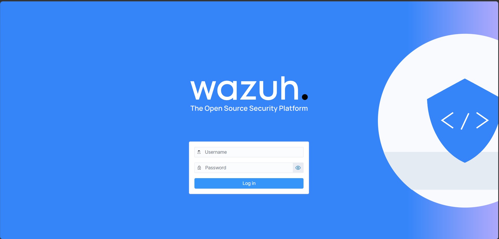
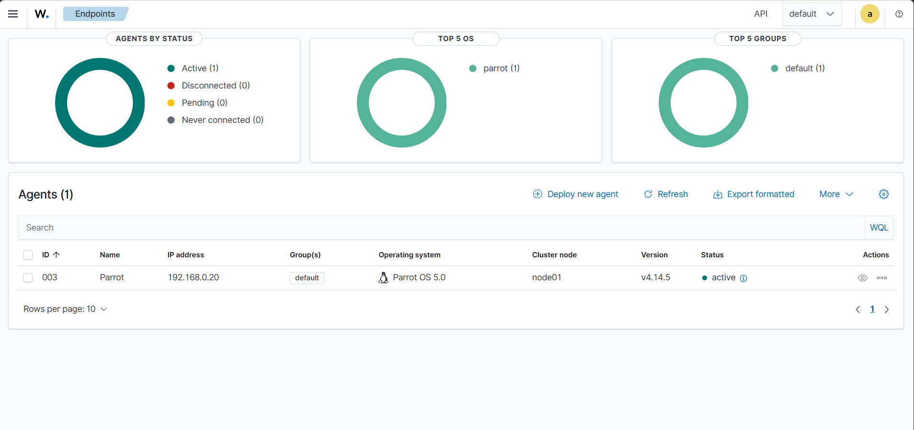
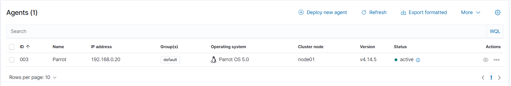
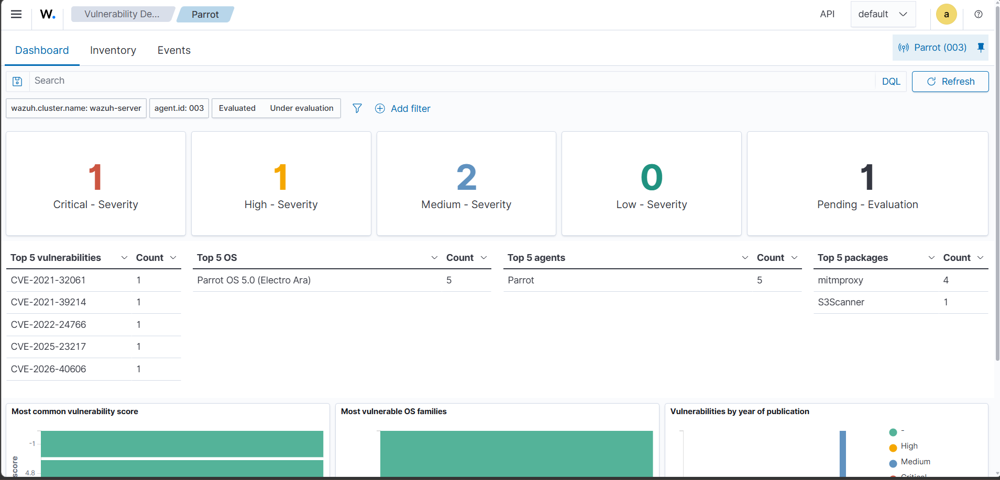
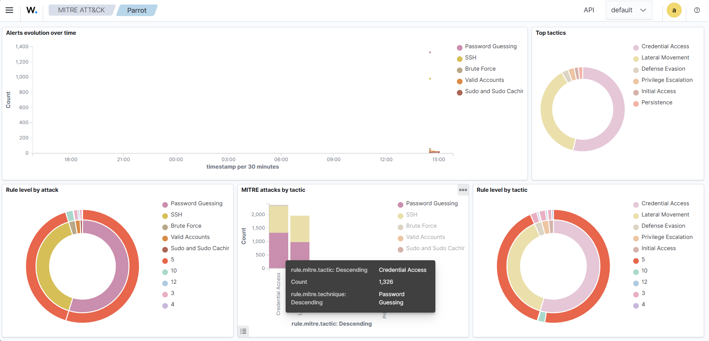

# Wazuh Security Monitoring Platform - Complete Setup Guide

[](https://wazuh.com/)
[](https://ubuntu.com/)
[](https://github.com/wazuh/wazuh/blob/master/LICENSE)

A comprehensive guide to deploying Wazuh as a Security Operations Center (SOC) platform, based on real-world implementation and testing.

## 📋 Table of Contents

- [Overview](#overview)
- [What is Wazuh](#what-is-wazuh)
- [Prerequisites](#prerequisites)
- [Installation](#installation)
- [Post-Installation Configuration](#post-installation-configuration)
- [Dashboard Access](#dashboard-access)
- [Agent Deployment](#agent-deployment)
- [Core Functionalities](#core-functionalities)
- [Real-World Use Cases](#real-world-use-cases)
- [Troubleshooting](#troubleshooting)
- [References](#references)

---

## Overview

Security monitoring often sounds complex until you actually deploy a proper platform and see it working in real-time. This guide documents the complete process of setting up Wazuh on Ubuntu, from installation to real-world threat detection.

**Key Achievement:** Transform a lab environment into a fully functioning Security Operations Center with real-time monitoring capabilities.

---

## What is Wazuh

Wazuh is an open-source security platform that provides comprehensive security monitoring and threat detection capabilities.

### Core Components

| Component | Description |
|-----------|-------------|
| **Wazuh Manager** | Central server that analyzes data from agents |
| **Wazuh Indexer** | Stores and indexes security events |
| **Wazuh Dashboard** | Web interface for visualization and management |
| **Wazuh Agent** | Lightweight agent installed on endpoints |

### Key Features

- **Host-based Intrusion Detection System (HIDS)**
- **Real-time Log Analysis**
- **File Integrity Monitoring (FIM)**
- **Vulnerability Detection**
- **Threat Intelligence Integration**
- **Security Configuration Assessment**
- **MITRE ATT&CK Framework Mapping**

---

## Prerequisites

### Host System Requirements

Since you're deploying via OVA, these requirements are for your **host machine** running the hypervisor:

- **Hypervisor:** VMware Workstation/ESXi, VirtualBox, or compatible virtualization platform
- **Host RAM:** Minimum 8GB (to allocate 4GB to Wazuh VM)
- **Host CPU:** Multi-core processor with virtualization support (Intel VT-x/AMD-V)
- **Host Disk:** 50GB free space minimum
- **Network:** Network adapter for VM connectivity

### Wazuh VM Specifications (Allocated from Host)

The OVA will require:

| Resource | Minimum | Recommended |
|----------|---------|-------------|
| **RAM** | 4GB | 8GB |
| **CPU Cores** | 2 | 4 |
| **Disk Space** | 50GB | 100GB |
| **Network** | 1 adapter | Bridged mode |

### Required Network Ports

Ensure these ports are accessible:

| Port | Purpose | Protocol |
|------|---------|----------|
| 443 | Wazuh Dashboard (HTTPS) | TCP |
| 1514 | Agent communication | TCP |
| 1515 | Agent enrollment | TCP |
| 55000 | Wazuh API | TCP |

### Virtualization Check

Verify your host supports virtualization:

**Linux:**
```bash
egrep -c '(vmx|svm)' /proc/cpuinfo
# If output > 0, virtualization is supported
```

**Windows:**
```powershell
# Check in Task Manager → Performance → CPU
# Look for "Virtualization: Enabled"
```
## Installation

...installation steps...

---


---

## Post-Installation Configuration
---

## Installation

### OVA Deployment Method

Wazuh provides a pre-configured OVA (Open Virtualization Appliance) file that includes all necessary components in a ready-to-use virtual machine.

#### Step 1: Download the OVA

Download the latest Wazuh OVA from the official website:
- **Source:** [Wazuh Downloads](https://documentation.wazuh.com/current/deployment-options/virtual-machine/virtual-machine.html)
- **File:** `wazuh-4.x.x.ova`
- **Size:** ~2-3 GB

#### Step 2: Import into Hypervisor

**VMware Workstation/ESXi:**

```
1. Open VMware
2. File → Open → Select the downloaded OVA file
3. Review VM settings:
   - RAM: 4GB minimum (8GB recommended)
   - CPU: 2 cores minimum
   - Disk: 50GB
4. Click "Import"
5. Wait for import to complete
```

**VirtualBox:**

```
1. Open VirtualBox
2. File → Import Appliance
3. Select the downloaded OVA file
4. Review and adjust settings if needed
5. Click "Import"
6. Wait for import to complete
```

#### Step 3: Configure Network Settings

**Option A: Bridged Adapter** (Recommended for production)
- VM gets its own IP on your network
- Accessible from other machines
- Configure in VM settings → Network → Adapter 1 → Bridged

**Option B: NAT with Port Forwarding**
- VM uses host's network connection
- Configure port forwarding:
  - Host Port 8443 → Guest Port 443 (Dashboard)
  - Host Port 1514 → Guest Port 1514 (Agent communication)

#### Step 4: Power On and Access

```bash
# Start the virtual machine
Power on the VM from your hypervisor

# Find the VM's IP address
# Login to VM console (credentials in Wazuh docs)
ip addr show

# Or check your DHCP server for the assigned IP
```

#### Step 5: Initial Login

Access the Wazuh Dashboard:
```
https://<VM_IP_ADDRESS>
```

**Default Credentials:**
- Username: `admin`
- Password: Available in VM console or documentation

**⚠️ Important:** Change the default password immediately after first login.

### What's Included in the OVA

The OVA comes with all components pre-configured:

| Component | Status | Port |
|-----------|--------|------|
| Wazuh Manager | ✅ Active | 1514, 1515 |
| Wazuh Indexer | ✅ Active | 9200 |
| Wazuh Dashboard | ✅ Active | 443 |
| SSL Certificates | ✅ Pre-generated | - |
| Filebeat | ✅ Configured | - |

---

## Post-Installation Configuration

### Change Default Credentials (Critical!)

The OVA comes with default credentials that must be changed immediately:

```bash
# SSH into the VM or use console
ssh wazuh-user@<VM_IP>

# Change Wazuh dashboard password
# Access the dashboard → Security → Internal users → admin → Edit
# Or via command line:
sudo /usr/share/wazuh-indexer/plugins/opensearch-security/tools/wazuh-passwords-tool.sh
```

### Configure Static IP (Recommended)

The OVA typically uses DHCP. For production, configure a static IP:

```bash
# Edit network configuration
sudo nano /etc/netplan/00-installer-config.yaml

# Example static IP configuration:
network:
  version: 2
  ethernets:
    ens33:
      addresses:
        - 192.168.1.100/24
      gateway4: 192.168.1.1
      nameservers:
        addresses:
          - 8.8.8.8
          - 8.8.4.4

# Apply changes
sudo netplan apply
```

### Disable Automatic Updates (Optional for Production)

To prevent version mismatches during automatic updates:

```bash
# Disable Wazuh repository
sed -i "s/^deb /#deb /" /etc/apt/sources.list.d/wazuh.list

# Update package lists
apt update
```

**Rationale:** In production environments, automatic upgrades can introduce compatibility issues. Manual updates allow for controlled testing.

### Verify Service Status

```bash
# Check Wazuh Manager
systemctl status wazuh-manager

# Check Wazuh Indexer
systemctl status wazuh-indexer

# Check Wazuh Dashboard
systemctl status wazuh-dashboard
```

All services should show `active (running)`.

---

## Dashboard Access

### Login

1. Navigate to `https://<server-ip>` in your browser
2. Accept the self-signed certificate warning (or install your own certificate)
3. Login with the admin credentials from installation



*Figure: Wazuh dashboard login interface used to authenticate users.*
### Dashboard Overview

The main dashboard provides:

- **Agents Summary:** Connected endpoints and their status
- **Alert Severity Levels:** High, Medium, Low severity counts
- **Security Events:** Recent alerts and notifications
- **Endpoint Security Modules:** Active monitoring modules
- **Threat Intelligence:** External threat feeds integration



*Figure: Main Wazuh dashboard displaying security events, endpoint status, and monitoring widgets.*

**Initial State:** On first login, you'll see "No agents registered" - this is normal until you deploy agents.

---

## Agent Deployment

### Understanding Wazuh Agents

The Wazuh Agent is a lightweight security sensor installed on endpoints that:

- Collects system logs
- Monitors file system changes
- Performs security configuration checks
- Detects vulnerabilities in installed packages
- Sends data securely to the Wazuh Manager



*Figure: Linux endpoint agent deployment and registration.*

### Deploying Linux Agent (Example: Debian/Ubuntu)

#### Step 1: Generate Deployment Commands

From the Wazuh Dashboard:

1. Navigate to **Endpoints** → **Deploy new agent**
2. Select **Linux**
3. Choose architecture (e.g., **DEB amd64**)
4. Specify agent name and manager IP

#### Step 2: Execute on Target System

```bash
# Download and install the agent package
wget https://packages.wazuh.com/4.x/apt/pool/main/w/wazuh-agent/wazuh-agent_4.14.3-1_amd64.deb

# Install with manager configuration
sudo WAZUH_MANAGER='<MANAGER_IP>' \
     WAZUH_AGENT_GROUP='default' \
     WAZUH_AGENT_NAME='<AGENT_NAME>' \
     dpkg -i ./wazuh-agent_4.14.3-1_amd64.deb

# Enable and start the agent service
sudo systemctl daemon-reload
sudo systemctl enable wazuh-agent
sudo systemctl start wazuh-agent
```

#### Step 3: Verify Agent Connection

```bash
# Check agent status locally
sudo systemctl status wazuh-agent

# View agent logs
sudo tail -f /var/ossec/logs/ossec.log
```

In the dashboard, the agent status should change to **Active** (green indicator).

### Deploying Windows Agent

```powershell
# Download Windows installer
Invoke-WebRequest -Uri https://packages.wazuh.com/4.x/windows/wazuh-agent-4.14.3-1.msi -OutFile wazuh-agent.msi

# Install with manager configuration
msiexec.exe /i wazuh-agent.msi /q WAZUH_MANAGER="<MANAGER_IP>" WAZUH_AGENT_NAME="<AGENT_NAME>"

# Start the service
NET START WazuhSvc
```

---

## Core Functionalities

### 1. File Integrity Monitoring (FIM)

**Purpose:** Detect unauthorized changes to critical system files.

**Monitored by Default:**
- `/etc` directory (Linux)
- `/usr/bin` (Linux)
- Windows registry keys
- Application configuration files

**Alert Example:**
```
Rule: 550 - Integrity checksum changed
File: /etc/passwd
Changed attributes: size, modification time, checksum
```

**Use Cases:**
- Compliance auditing (PCI-DSS, HIPAA)
- Detecting malware persistence mechanisms
- Configuration drift detection

### 2. Vulnerability Detection

**How it Works:**
1. Agent collects installed package information
2. Manager compares against vulnerability databases (NVD, vendor feeds)
3. Alerts generated with CVE details and severity scores

**Example Detection:**



*Figure: Wazuh Vulnerability Detection dashboard displaying detected CVEs and severity ratings.*


**Integration with Package Managers:**
- Debian/Ubuntu: `dpkg`
- RedHat/CentOS: `rpm`
- Windows: WMI queries

### 3. Security Configuration Assessment

**Standards Supported:**
- CIS Benchmarks
- PCI-DSS requirements
- GDPR guidelines
- NIST frameworks

**Assessment Examples:**

```yaml
# Password Policy Check
Check ID: 1234
Description: Ensure password complexity is enabled
Result: FAIL
Remediation: Edit /etc/pam.d/common-password

# SSH Hardening Check
Check ID: 5678
Description: Ensure SSH root login is disabled
Result: PASS
```

### 4. Log Analysis and Correlation

**Supported Log Sources:**
- Syslog
- Windows Event Logs
- Application logs (Apache, Nginx, MySQL)
- Firewall logs
- Cloud platform logs (AWS CloudTrail, Azure Monitor)

**Correlation Capabilities:**
- Multiple failed login attempts → Brute force alert
- File modification + privilege escalation → Advanced threat alert
- Unusual process execution + network connection → Potential malware

### 5. MITRE ATT&CK Mapping

Every alert is mapped to MITRE ATT&CK tactics and techniques, providing context:

```
Alert: Suspicious PowerShell Command
MITRE Tactic: Execution (TA0002)
MITRE Technique: PowerShell (T1059.001)
Context: Attacker attempting to execute malicious code
```



*Figure: Security events mapped to MITRE ATT&CK techniques.*

---

## Real-World Use Cases

### Use Case 1: Brute Force Attack Detection

**Scenario:** Attacker attempts SSH brute force on Linux server.

**Detection Flow:**
1. Agent monitors `/var/log/auth.log`
2. Multiple failed authentication attempts detected
3. Rule triggers: "Multiple authentication failures"
4. Alert severity: Medium → High (if threshold exceeded)

**Dashboard View:**
- Alert count by source IP
- Geographic location of attacker
- Timeline of attack attempts
- Affected users/accounts

**Response Actions:**
- Block source IP via firewall
- Increase authentication requirements
- Enable fail2ban integration

### Use Case 2: Malware Detection via File Changes

**Scenario:** Malware modifies system binaries.

**Detection Flow:**
1. FIM detects change to `/usr/bin/ls`
2. File checksum comparison shows modification
3. Alert generated with file details
4. Correlation with process execution logs

**Investigation:**
```bash
# View FIM alert details
File: /usr/bin/ls
Previous checksum: abc123...
New checksum: def456...
Modified by: Process ID 5678
User: root
```

### Use Case 3: Vulnerability Management

**Scenario:** Critical vulnerability discovered in installed package.

**Workflow:**
1. Vulnerability scanner runs daily
2. Outdated package detected: `apache2 2.4.41`
3. CVE-2021-44790 flagged (Critical)
4. Alert with patch availability information

**Remediation:**
```bash
# Check affected systems
Dashboard → Vulnerabilities → CVE-2021-44790

# Deploy patch
sudo apt update
sudo apt install apache2

# Verify fix
Dashboard confirms vulnerability resolved
```

---

## Troubleshooting

### Agent Not Connecting

**Symptoms:**
- Agent shows "Never connected" in dashboard
- Agent status is "Disconnected"

**Solutions:**

```bash
# Check agent configuration
cat /var/ossec/etc/ossec.conf

# Verify manager IP is correct
grep -A 5 "<server>" /var/ossec/etc/ossec.conf

# Check network connectivity
telnet <MANAGER_IP> 1514

# Restart agent
sudo systemctl restart wazuh-agent

# Check agent logs for errors
sudo tail -f /var/ossec/logs/ossec.log
```

### Dashboard Not Accessible

**Symptoms:**
- Cannot access `https://<server-ip>`
- Connection timeout or refused

**Solutions:**

```bash
# Check dashboard service
systemctl status wazuh-dashboard

# Verify port 443 is listening
netstat -tulpn | grep 443

# Check firewall rules
ufw status
# If needed: ufw allow 443

# Restart dashboard
systemctl restart wazuh-dashboard
```

### High Memory Usage

**Symptoms:**
- Server becomes slow
- Manager service crashes

**Solutions:**

```bash
# Check resource usage
top
htop

# Optimize indexer memory (edit /etc/wazuh-indexer/jvm.options)
-Xms4g  # Minimum heap size
-Xmx4g  # Maximum heap size

# Adjust based on available RAM (typically 50% of total RAM)

# Restart indexer
systemctl restart wazuh-indexer
```

---

## Key Learnings

### Before Wazuh
- Logs were scattered across systems
- Alerts were reactive, not proactive
- Limited visibility into security posture
- Manual correlation required

### After Wazuh
- Centralized log management
- Real-time threat detection
- Complete endpoint visibility
- Automated correlation and alerting
- Compliance reporting capabilities

### Best Practices Discovered

1. **Start Small:** Deploy on test environment first
2. **Tune Rules:** Reduce false positives by customizing rules
3. **Regular Updates:** Plan maintenance windows for updates
4. **Backup Configuration:** Export dashboard configurations regularly
5. **Monitor Resources:** Ensure adequate server resources
6. **Document Customizations:** Track custom rules and integrations

---

## References

- **Official Documentation:** [https://documentation.wazuh.com/](https://documentation.wazuh.com/)
- **GitHub Repository:** [https://github.com/wazuh/wazuh](https://github.com/wazuh/wazuh)
- **Community Forum:** [https://groups.google.com/g/wazuh](https://groups.google.com/g/wazuh)
- **MITRE ATT&CK:** [https://attack.mitre.org/](https://attack.mitre.org/)

---

## License

This guide is provided for educational purposes. Wazuh is released under the GPL-2.0 license.

---

## Contributing

Found an issue or have improvements? Feel free to:
- Open an issue
- Submit a pull request
- Share your Wazuh deployment experiences

---

**Last Updated:** May 2024  
**Wazuh Version:** 4.14.3  
**Tested On:** Ubuntu 22.04 LTS